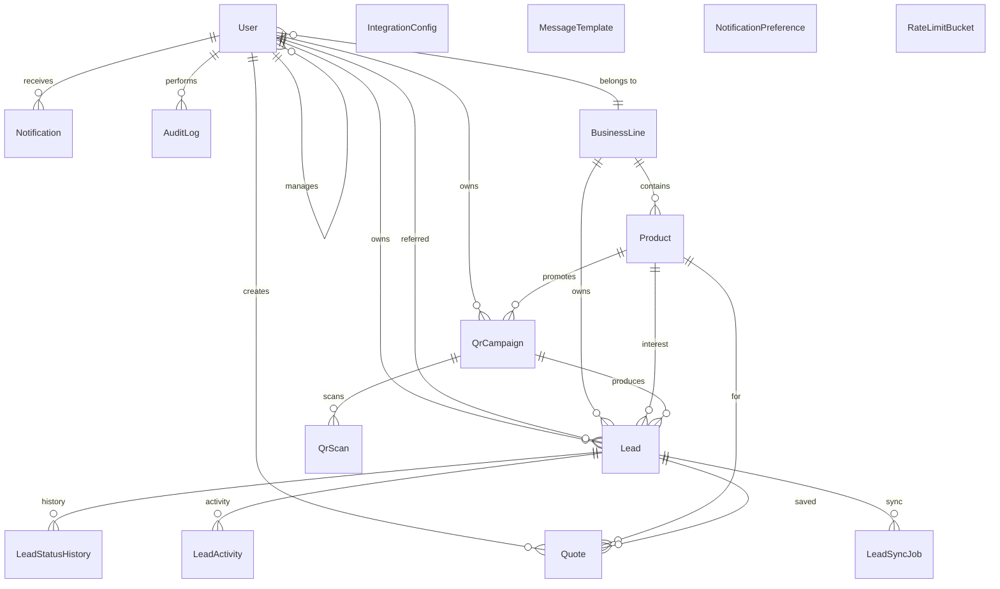

# Data Model

Money is stored as **`BigInt` piastres** (1 EGP = 100 piastres). Encrypted columns use AES-256-GCM, keyed by `APP_ENCRYPTION_KEY`.

## ERD (Mermaid)

## Field reference (selected)

### Lead

| Field                  | Type         | Notes                                                  |
| ---------------------- | ------------ | ------------------------------------------------------ |
| `customerEmailEnc`     | `String?`    | AES-256-GCM ciphertext                                 |
| `nationalIdEnc`        | `String?`    | AES-256-GCM ciphertext                                 |
| `currentStatus`        | `LeadStatus` | Driven by state machine                                |
| `referredByEmployeeId` | `String?`    | Stays linked across BL referrals for credit/commission |
| `ownerEmployeeId`      | `String?`    | Current owner; changes on referral/reassignment        |
| `consentGivenAt`       | `DateTime`   | Required (PDPL)                                        |

### Product

| Field                                     | Type     | Notes                            |
| ----------------------------------------- | -------- | -------------------------------- |
| `amountMinPiastres` / `amountMaxPiastres` | `BigInt` | Money in piastres                |
| `interestRateBps`                         | `Int`    | Basis points (1850 = 18.50% APR) |
| `adminFeeBps` / `insuranceFeeBps`         | `Int`    | Basis points                     |

### IntegrationConfig

| Field          | Type     | Notes                                          |
| -------------- | -------- | ---------------------------------------------- |
| `valueEncJson` | `String` | Encrypted JSON config (credentials, base URLs) |

See [`prisma/schema.prisma`](../prisma/schema.prisma) for the full source of truth.
