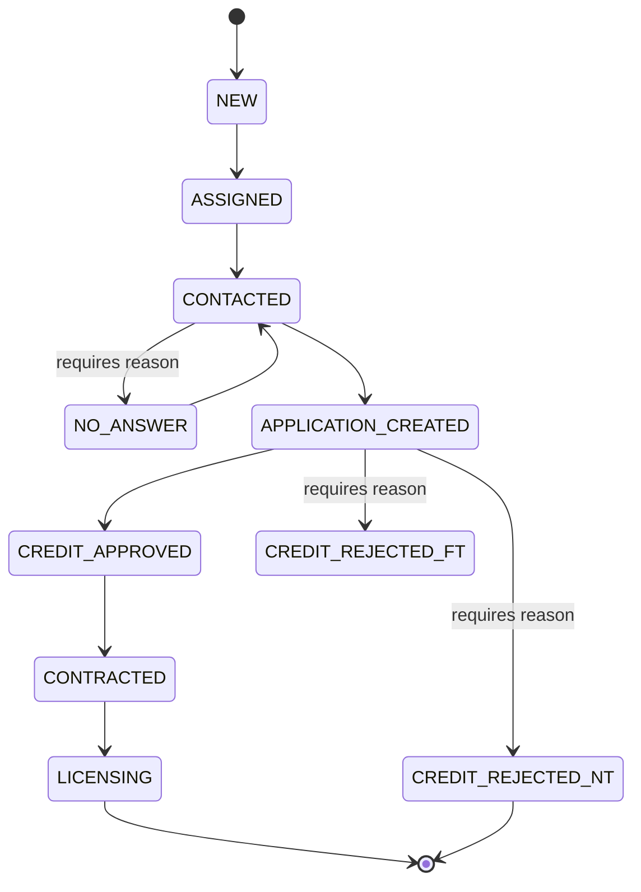

# Lead State Machine

Implemented in `src/lib/leads/state-machine.ts` (Phase 3). Every transition validates legality, requires a reason for rejections / `NO_ANSWER`, and writes a `LeadStatusHistory` row.

## Rules

| From                  | To                    | Allowed roles                   | Required         |
| --------------------- | --------------------- | ------------------------------- | ---------------- |
| `NEW`                 | `ASSIGNED`            | BL Owner / Team Manager / Admin | owner assignment |
| `ASSIGNED`            | `CONTACTED`           | owner / team / BL / admin       | —                |
| `CONTACTED`           | `NO_ANSWER`           | owner / team / BL / admin       | reason           |
| `NO_ANSWER`           | `CONTACTED`           | owner / team / BL / admin       | —                |
| `CONTACTED`           | `APPLICATION_CREATED` | owner / team / BL / admin       | —                |
| `APPLICATION_CREATED` | `CREDIT_APPROVED`     | BL Owner / Admin                | —                |
| `APPLICATION_CREATED` | `CREDIT_REJECTED_FT`  | BL Owner / Admin                | reason           |
| `APPLICATION_CREATED` | `CREDIT_REJECTED_NT`  | BL Owner / Admin                | reason           |
| `CREDIT_APPROVED`     | `CONTRACTED`          | BL Owner / Admin                | —                |
| `CONTRACTED`          | `LICENSING`           | BL Owner / Admin                | —                |

`CREDIT_REJECTED_FT` (First-time) is recoverable — a new application may be created later. `CREDIT_REJECTED_NT` (Not eligible / terminal) closes the lead.

`LICENSING` is the terminal success state.
